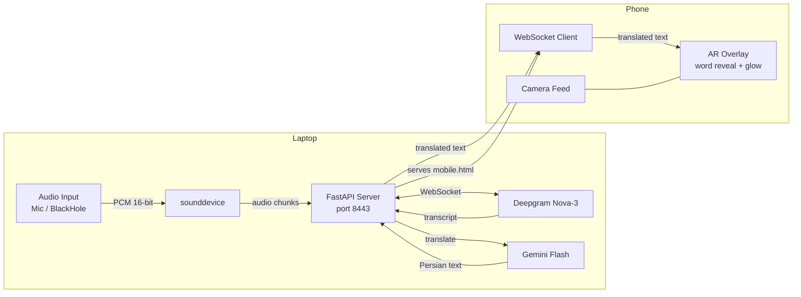

# AR Transcribe

Real-time speech-to-text **and translation** as an augmented reality overlay on your phone. Audio is captured on the laptop, transcribed by Deepgram Nova-3, translated to Persian (Farsi) by Gemini, and streamed to the phone where words animate in one by one with a glowing blue effect.

## Architecture



## How It Works

1. `server.py` opens a selected audio input device via `sounddevice`
2. 100ms PCM chunks are streamed to Deepgram's live WebSocket API
3. Deepgram returns the final transcript (~300ms latency)
4. The transcript is sent to Gemini Flash for translation into Persian (~500ms)
5. The translated text is broadcast to all connected phones via WebSocket
6. `mobile.html` animates each word into view on the camera feed with a glowing effect

Total latency: ~800ms from speech to translated text on screen.

## Project Structure

```
ar-transcribe/
├── server.py       # FastAPI — audio capture, Deepgram, Gemini translation, WebSocket
└── mobile.html     # Phone AR viewer — camera feed + animated text overlay
```

## Setup

### Requirements

```bash
uv add fastapi uvicorn websockets sounddevice numpy google-genai
```

You need:
- [Deepgram](https://deepgram.com) API key — free tier: 200 hours/month
- [Gemini](https://ai.google.dev) API key — for translation

### Run

```bash
DEEPGRAM_API_KEY=your_deepgram_key GEMINI_API_KEY=your_gemini_key uv run python ar-transcribe/server.py
```

On startup it lists available audio input devices:

```
Available audio input devices:
  0) [0] MacBook Pro Microphone
  1) [2] BlackHole 2ch
  2) [3] MirrorMeister Audio

Press Enter to use default, or enter a number:
```

Then on your phone open:

```
https://<your-laptop-ip>:8443/ar-transcribe/mobile.html
```

> The server serves the static file — no separate static server needed.

## Changing the Target Language

Edit `TARGET_LANG` in `server.py`:

```python
TARGET_LANG = "Persian (Farsi)"  # change to any language
```

## Audio Input Options

| Source | How |
|--------|-----|
| **Laptop mic** | Default — pick `MacBook Pro Microphone` |
| **System audio (YouTube, video calls)** | Install BlackHole (see below), pick `BlackHole 2ch` |
| **Room / speaker nearby** | Point laptop toward the sound source |

### Capturing System Audio with BlackHole

To translate audio playing on screen (YouTube, podcasts, video calls):

1. Install BlackHole: `brew install blackhole-2ch`
2. Open **Audio MIDI Setup** → `+` → **Create Multi-Output Device**
3. Check **BlackHole 2ch** + **MacBook Pro Speakers** (so you still hear audio)
4. **System Settings → Sound → Output** → select **Multi-Output Device**
5. **System Settings → Sound → Input** → select **BlackHole 2ch**
6. Restart the server and pick **BlackHole 2ch**

## Phone UI

- **Green dot** — connected to server
- **🎙 icon** — pulsing when live
- Words animate in one by one (70ms apart) with a slide-up effect
- Current sentence glows in blue and pulses
- Last 3 sentences visible, older ones fade out

## Certificate

The server auto-generates a self-signed TLS certificate on first run. Accept the browser warning once on both laptop and phone.

## Use Cases

- **Real-time translation** — watch a video in any language, read it in Persian on your phone
- **Accessibility** — live captions for deaf/hard-of-hearing in real conversations
- **Language learning** — hear English, read Persian side by side
- **Meetings** — translate a foreign language speaker in real time
