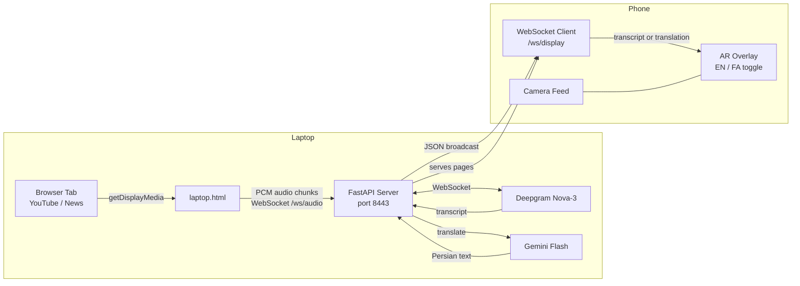

# AR Transcribe

Real-time speech transcription and translation as an augmented reality overlay on your phone. Share any browser tab (YouTube, news, podcasts) from your laptop and see live English transcription or Persian translation floating over your phone camera feed — word by word, with a glowing blue effect.

No BlackHole. No mic setup. Just share a tab and open a URL on your phone.

## Architecture



## How It Works

1. Open `laptop.html` in your laptop browser
2. Click **Start Capturing** → pick the tab playing audio → check **Share tab audio**
3. Browser captures tab audio via `getDisplayMedia()` and streams PCM to the server
4. Server forwards audio to Deepgram → gets transcript (~300ms)
5. Transcript is sent to Gemini Flash for Persian translation (~500ms)
6. Both transcript and translation are broadcast as JSON to all connected phones
7. Phone shows either English transcript or Persian translation — toggle with EN / FA button

## Project Structure

```
ar-transcribe/
├── server.py       # FastAPI — /ws/audio (laptop), /ws/display (phone), Deepgram, Gemini
├── laptop.html     # Laptop page — tab audio capture via getDisplayMedia()
└── mobile.html     # Phone AR viewer — camera feed + animated text overlay + EN/FA toggle
```

## Setup

### Requirements

```bash
uv add fastapi uvicorn websockets numpy google-genai
```

You need:
- [Deepgram](https://deepgram.com) API key — free tier: 200 hours/month
- [Gemini](https://ai.google.dev) API key — for translation

### Run

```bash
DEEPGRAM_API_KEY=your_deepgram_key GEMINI_API_KEY=your_gemini_key uv run python ar-transcribe/server.py
```

Then open on your **laptop**:
```
https://<your-laptop-ip>:8443/ar-transcribe/laptop.html
```

And on your **phone**:
```
https://<your-laptop-ip>:8443/ar-transcribe/mobile.html
```

> Accept the self-signed certificate warning once on both devices.

## Usage

1. On laptop: click **▶ Start Capturing**, pick the YouTube/news tab, check **Share tab audio**
2. On phone: open the mobile URL, tap **EN** for English transcript or **FA** for Persian translation
3. Speak or play any video — text appears on your phone in real time

## Changing the Target Language

Edit `TARGET_LANG` in `server.py`:

```python
TARGET_LANG = "Persian (Farsi)"  # change to any language
```

## Phone UI

- **EN / FA toggle** — switch between English transcript and Persian translation
- **Green dot** — connected to server
- **🎙 icon** — pulsing when live
- Words animate in one by one (70ms apart) with a slide-up effect
- Current sentence glows in blue and pulses
- Last 3 sentences visible, older ones fade out

## Certificate

The server auto-generates a self-signed TLS certificate on first run, required for `getDisplayMedia()` and phone camera access over HTTPS.

## Use Cases

- **Real-time translation** — watch a video in English, read it in Persian on your phone
- **Live news** — follow foreign language broadcasts with live captions
- **Language learning** — toggle between original and translation while watching content
- **Meetings** — share the meeting tab, get live translation for non-native speakers
